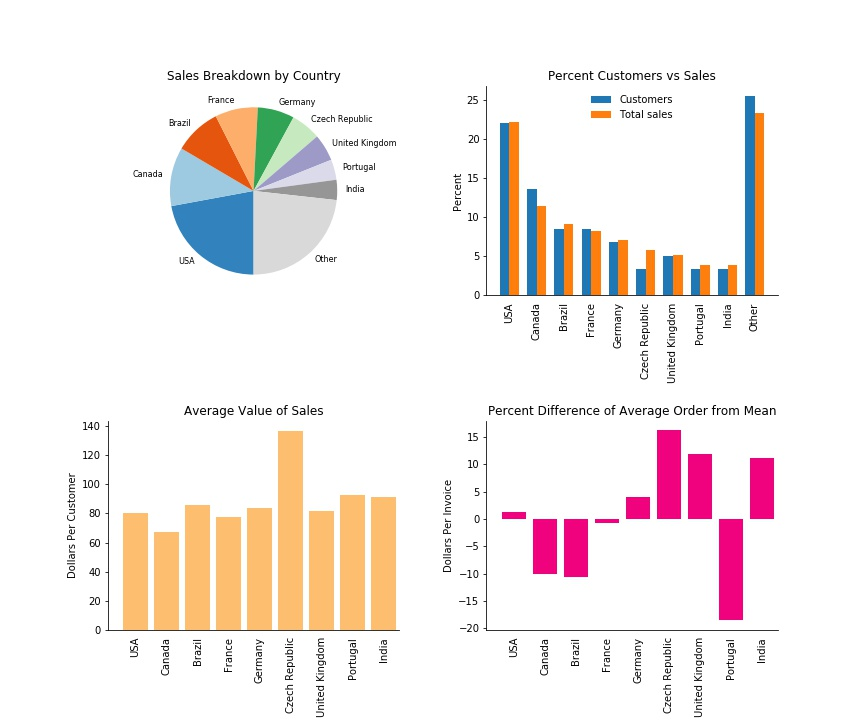

# Answering Business Questions Using SQL

This is a guided project under Dataquest (Data Engineering track) where I used SQL to answer business questions about a fictional digital music store. The [Chinook database](https://github.com/lerocha/chinook-database) contains data about the artists, songs, and albums from the music shop, as well as information on employees, customers, and the customers' purchases.

My goal in this project is to find answers on the following:

* Which music genres sell the most tracks in the USA?
* What is the sales performance of the shop's employees?
* Which countries have the potential for growth?
* What percentage of purchases are whole albums versus individual tracks?
* Which artist is used in most playlists?
* How many tracks have been purchased versus not purchased?
* Is the range of tracks in the store reflective of their sales popularity?
* Do protected versus non-protected media types affect sales popularity?

For the data analysis, I performed the following:

* Created helper functions to assist in reading SQL queries into DataFrames and returning a list of all tables and views of the database
* Determined the top-selling music genres in the USA in terms of the number and percentage of tracks sold 
* Analyzed the performance of employees in terms of total dollar sales
* Determined the total number of customers, the total value of sales, the average value of sales per customer, and the average order value per country
* Obtained the number and percentage of invoices attributed to purchases of the whole album
* Determined the artist mostly used in the playlists
* Determined the number and percentage of unpurchased tracks of the store
* Obtained the percentage of tracks and sales per music genre
* Analyzed the effect of media type (protected versus non-protected) on the sales performance

The results show that:

* `Rock`, `Alternative & Punk`, `Metal`, and `R&B/Soul` are among the top-selling music genres in the USA. The addition of new albums and tracks from American artists under these genres could improve the sales performance of the store.
* The sales performance of employees seems to depend on their hiring dates. 
* Czech Republic, United Kingdom, and India show potential for growth due to high average values of sales and above-average order values. 
* About 20% of total sales come from whole album purchases. The store should continue to selling individual tracks and whole albums. 
* The artist `Iron Maiden` is mostly used in the playlists.
* About half of the available tracks in the store remain unpurchased. 
* The range of tracks in the store mostly reflects the sales performance. 
* The tracks categorized under non-protected media types significantly sell better than protected types. 

Please see the `chinook.db` database file and the full exploratory data analysis in the `Project4`.ipynb notebook above.
